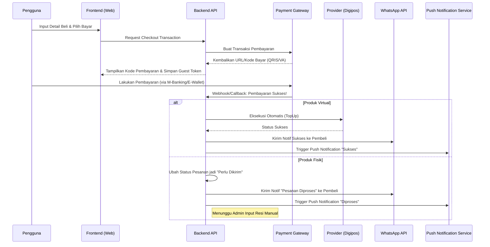
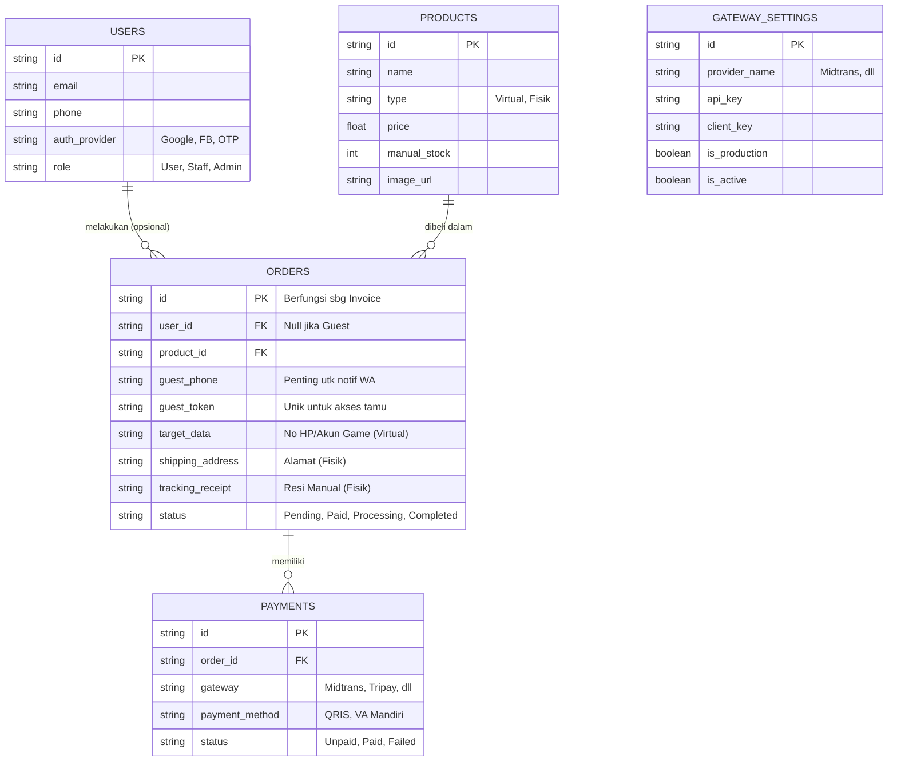

# PRD — Project Requirements Document

## 1. Overview
Banyak pengguna internet mengalami batal beli (*drop-off*) saat bertransaksi produk digital karena diwajibkan membuat akun atau melewati proses keranjang belanja (*shopping cart*) yang panjang. 

Aplikasi ini bertujuan untuk menyelesaikan masalah tersebut dengan menyediakan website *marketplace* ala Codashop/VCGamers dengan balutan visual identitas Telkomsel (dominasi warna Merah, Biru Dongker/Navy, Putih, dan Abu-abu). Platform ini mengutamakan kecepatan transaksi melalui fitur **"Direct Checkout"** (Beli Langsung) dan **"Guest Checkout"** (Beli tanpa mendaftar akun). Website ini melayani pembelian Produk Virtual (Pulsa, Paket Data dari Digipos, Voucher Game) secara instan, serta Produk Fisik (Kartu Perdana, Modem Orbit) dari Mitra Resmi Telkomsel. 

## 2. Requirements
- **Kapasitas Pengguna:** Sistem harus stabil menangani 1.000 hingga 10.000 pengunjung aktif per bulan.
- **Visual & UI/UX:** Desain modern terinspirasi VCGamers/Codashop, menggunakan palet warna khas Telkomsel (Merah, Biru Navy, Putih, Dark Grey).
- **Model Transaksi:** Tanpa keranjang belanja. Transaksi langsung terjadi pada halaman detail produk.
- **Tipe Produk:** 
  - *Virtual:* Pulsa, voucher internet/game, paket digital (terstimulasi otomatis saat dibayar).
  - *Fisik:* Modem Orbit, dll (membutuhkan input alamat dan pengisian resi manual oleh admin).
- **Manajemen Kredensial:** Konfigurasi Payment Gateway (API Key, Environment Sandbox/Prod) wajib bisa diubah dinamis oleh admin melalui *dashboard* tanpa *coding* ulang.
- **Metode Pembayaran:** Fleksibel untuk ditambahkan secara bertahap (Midtrans, Tripay, Doku) mendukung Virtual Account, E-Wallet, dan QRIS.
- **Peran Sistem:** Memiliki akses hierarki untuk `Admin` (akses penuh termasuk pengaturan Payment Gateway) dan `Staff` (fokus mengelola pesanan dan resi).

## 3. Core Features
**Fitur Sisi Pengguna (User-Facing):**
- **Form Beli Langsung (Express Checkout):** Halaman tunggal untuk memilih nominal, memasukkan nomor tujuan/alamat, memilih kurir (untuk fisik), memilih metode pembayaran, dan langsung bayar.
- **Login Fleksibel (Opsional):** 
  - *Verifikasi OTP:* Login menggunakan Nomor HP dengan verifikasi kode OTP (One-Time Password) yang dikirim via WhatsApp atau SMS.
  - *OAuth2:* Integrasi login cepat menggunakan akun Google atau Facebook.
  - *Tujuan:* Khusus bagi pengguna yang ingin menyimpan riwayat transaksi secara permanen.
- **Akses Sesi Tamu (Guest Session):** 
  - Pembeli tanpa akun tetap dapat mengakses detail pesanan terakhir mereka.
  - Mekanisme menggunakan *Unique Tracking Link* yang dikirim via WhatsApp/Email setelah transaksi, serta penyimpanan sementara (*cache*) di browser pengguna.
- **Pelacakan Pesanan:** Cek status pesanan dan pelacakan resi (untuk produk fisik) menggunakan Nomor Pesanan (*Invoice Number*) atau Link Unik Tamu.
- **Notifikasi Multi-Channel & Push:** 
  - Pemberitahuan status pesanan melalui Inbox In-App (jika login).
  - Pesan otomatis via WhatsApp.
  - **Push Notification Browser:** Notifikasi *real-time* muncul di layar perangkat pengguna saat status transaksi berubah (misal: Pembayaran Diterima, Pesanan Dikirim) tanpa perlu membuka aplikasi.

**Fitur Sisi Admin & Staff (Dashboard):**
- **Manajemen Produk:** Tambah/Edit/Hapus produk, penentuan harga, pengaturan gambar, dan manajemen stok secara manual.
- **Manajemen Pesanan:** Melihat daftar transaksi. Khusus pesanan fisik, terdapat kolom untuk `Staff` memperbarui nomor resi pengiriman secara manual.
- **Konfigurasi Payment Gateway:** Modul khusus untuk `Admin` mengganti status koneksi (Sandbox/Production) dan memasukkan API Key dari penyedia layanan pembayaran (Midtrans, dll).
- **Manajemen Staff:** Penambahan akun staff untuk membantu proses operasional harian.

## 4. User Flow
1. **Pilih Produk:** Pengguna masuk ke halaman utama aplikasi dan memilih kategori produk (misal: Paket Data Keluaraga atau Modem Orbit).
2. **Pengisian Data (Tanpa Keranjang):** 
   - *Jika Produk Virtual:* Pengguna memasukkan Nomor HP target atau ID Game.
   - *Jika Produk Fisik:* Pengguna mengisi form Alamat Pengiriman lengkap.
3. **Pilih Pembayaran:** Pengguna memilih metode pembayaran, misal QRIS Bank Mandiri (Midtrans).
4. **Checkout & Bayar:** Pengguna klik "Beli Sekarang" dan diarahkan untuk melakukan *scan* QRIS.
   - *Guest Session:* Sistem menghasilkan *Unique Token* untuk akses tamu.
5. **Pemrosesan (Sistem Backend):** 
   - Setelah sistem Payment Gateway mencatat pembayaran sukses, *Webhook* aktif.
   - *Jika Virtual:* Sistem otomatis memanggil API Pihak ke-3 (misal H2H Digipos) untuk mengirim paket langsung ke nomor pembeli.
   - *Jika Fisik:* Pesanan masuk ke Dashboard Staff dengan status "Perlu Dikirim".
6. **Notifikasi:** 
   - Pengguna menerima pesan WhatsApp bahwa pesanan berhasil / sedang diproses.
   - **Push Notification:** Browser pengguna menampilkan notifikasi *popup* status terbaru.
   - Jika barang fisik, pengguna akan dikirimkan resi via WhatsApp dan notifikasi push setelah staff meng-input resi.
7. **Akses Tamu:** Pengguna tamu dapat mengklik link unik yang diterima atau membuka kembali browser yang sama untuk melihat status pesanan terakhir tanpa login.

## 5. Architecture
Berikut adalah gambaran alur sistem dari pengguna menekan tombol beli hingga notifikasi dikirimkan:

## 6. Database Schema
Berikut adalah tabel utama yang dibutuhkan. Sistem ini dirancang untuk mengakomodasi pembeli tanpa akun (Guest), sehingga informasi kontak penting turut disimpan di tabel *Orders*. Tabel Orders diperbarui untuk mendukung *Guest Session* yang aman.

- **Users:** Menyimpan data pengguna yang memilih untuk mendaftar/login, serta data Admin/Staff.
- **Products:** Menyimpan master data produk baik virtual maupun fisik.
- **Orders:** Menyimpan rekaman transaksi. Meliputi relasi ke pengguna (opsional jika *guest*), metode pembayaran, status pemesanan, dan.token akses tamu.
- **Gateway_Settings:** Menyimpan API/Client Keys untuk sistem pembayaran yang diatur admin.

## 7. Tech Stack
Berikut adalah rekomendasi teknologi berbasis *Modern Javascript Ecosystem* yang dapat bekerja harmonis untuk merealisasikan aplikasi ini:

*   **Frontend:** **Next.js** (React framework unggulan untuk performa SEO dan SSR).
*   **Styling & UI:** **Tailwind CSS** (Mudah melakukan kustomisasi warna Telkomsel) dipadukan dengan **shadcn/ui** (untuk komponen UI yang interaktif, elegan, dan bisa dipersonalisasi).
*   **Backend:** Next.js Route Handlers (API Routes di dalam Next.js untuk menjaga sistem tetap efisien sebagai aplikasi monorepo).
*   **Database ORM:** **Drizzle ORM** (ringan, *type-safe*, dan sangat cepat).
*   **Database:** **SQLite** (menggunakan layanan seperti Turso Cloud untuk kemudahan set-up skala 10k pengguna tanpa biaya *server* yang mahal). *Catatan teknis: Jika seiring waktu order fisik dan reporting bertambah masif, mudah untuk dimigrasi ke PostgreSQL.*
*   **Authentication:** **Better Auth** (Sistem autentikasi modern yang mendukung kredensial lokal, OTP, maupun Oauth Google/Facebook dengan sangat mudah).
*   **Notifikasi:**
    *   *WhatsApp API:* Fonnte / Watzap / Wablas (Lokal, terjangkau).
    *   *Push Notification:* Web Push API (Standar Browser) atau layanan pihak ketiga seperti OneSignal untuk manajemen notifikasi browser yang lebih robust.
*   **Integrasi Pihak Ketiga (Saran Ekstra):**
    *   *Payment Gateway Utama:* Midtrans.